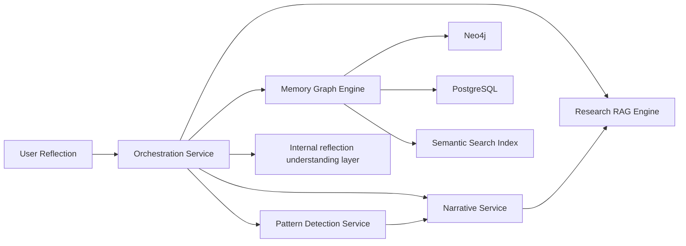

# Memory Platform Architecture

The platform is split into four independent services plus an orchestration layer that communicate through explicit APIs and shared persistence contracts.

## Services

1. `memory-graph-engine`
   - Extracts reflections into graph nodes and edges
   - Persists to Neo4j as the source of truth
   - Persists to PostgreSQL as the durable backup and event log
   - Handles ranking, traversal, semantic search, and graph evolution tracking

2. `pattern-detection-service`
   - Detects recurring emotional, cognitive, behavioral, and relationship patterns
   - Tracks pattern frequency, intensity, confidence, trend, and evolution
   - Generates weekly, monthly, and quarterly reports

3. `narrative-service`
   - Constructs evolving life narratives from accumulated memories and pattern evidence
   - Tracks narrative emergence, growth, decline, completion, chapters, and identity evolution
   - Generates monthly, quarterly, and annual personal evolution reports

4. `research-rag-engine`
   - Retrieves evidence-based psychology and human-development knowledge
   - Performs document ingestion, chunking, embedding generation, hybrid search, reranking, and citation tracking
   - Returns source-level evidence, publication metadata, and compressed educational context

5. `orchestration-service`
   - Normalizes reflections and queries before routing
   - Coordinates ingest, recall, and update workflows
   - Applies policy, retries, fallback logic, and service isolation

## Data Flow

## Responsibilities

- The graph engine owns node identity, edge identity, temporal versioning, ranking, and backups.
- Neo4j stores the live graph for traversal and relationship reasoning.
- PostgreSQL stores immutable reflections, graph events, materialized memory records, pattern occurrences, narrative histories, research documents, and backup snapshots.
- The orchestration layer stays thin and delegates specialized work to the four services.

## Why this split works

- Debugging is simpler because extraction, storage, ranking, and orchestration are isolated.
- Scaling is simpler because graph writes, retrieval reads, and orchestration can scale separately.
- Model upgrades are safer because extractor logic is isolated from graph persistence logic.
